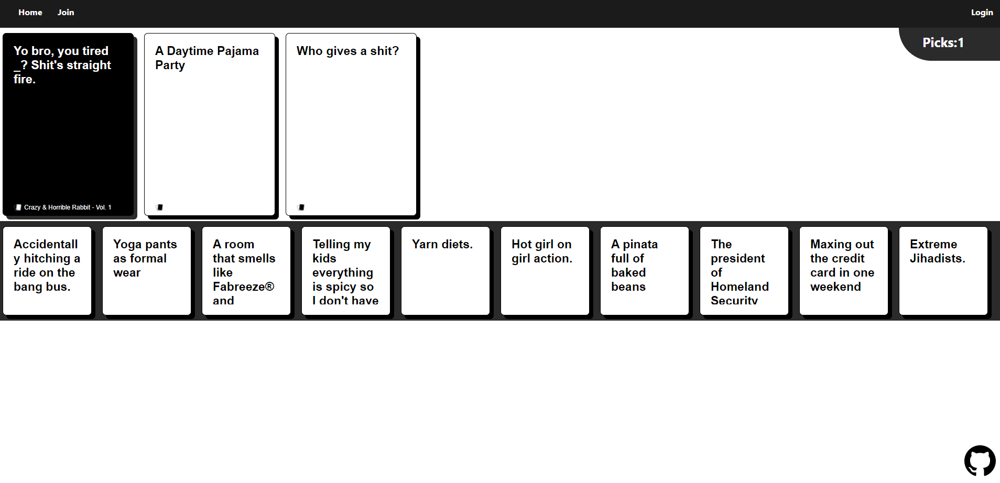

# Cards Against Humanity

A web game based on the popular card game "Cards Against Humanity"

**Home page**

**Login page**

Here you can set your nickname and a random id will be generated

**Lobby page**

**Join page**

Here you can enter the "Game Id" to join any game that hasn't started yet

**Game page**

The actual game page.

## Local installation

After cloning/downloading the whole application, the following command must be executed inside of the **root** and **client** directories to install all the project packages:

> npm install

Then a **data.js** file must be created at **client/src/game** exporting an object with your Firebase credentials. i.e:

**client/src/game/data.js**

    const data = {

    	key: "XXXXXXXXXXX",

    	messagingSenderId: "XXXXXXXXXXX",

    	appId: "XXXXXXXXXXX",

    	measurementId: "XXXXXXXXXXX",

    	authDomain: "XXXXXXXXXXX",

    	projectId: "XXXXXXXXXXX",

    	storageBucket: "XXXXXXXXXXX"

    };

    export default data;

### Some thoughts

> I think this project is a little messed up so I'll probably make a new version with different technologies and cleaner code in the future
> It was my first "big-project" so I hope you understand
